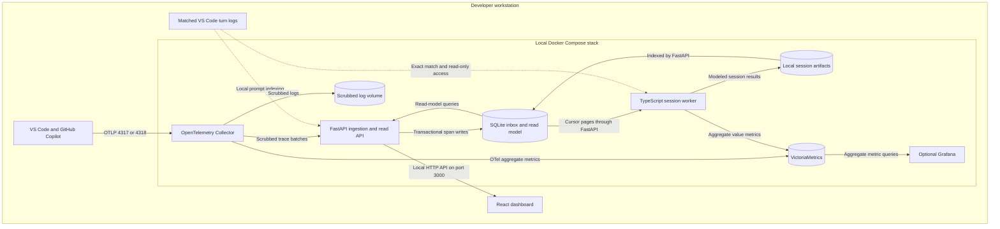
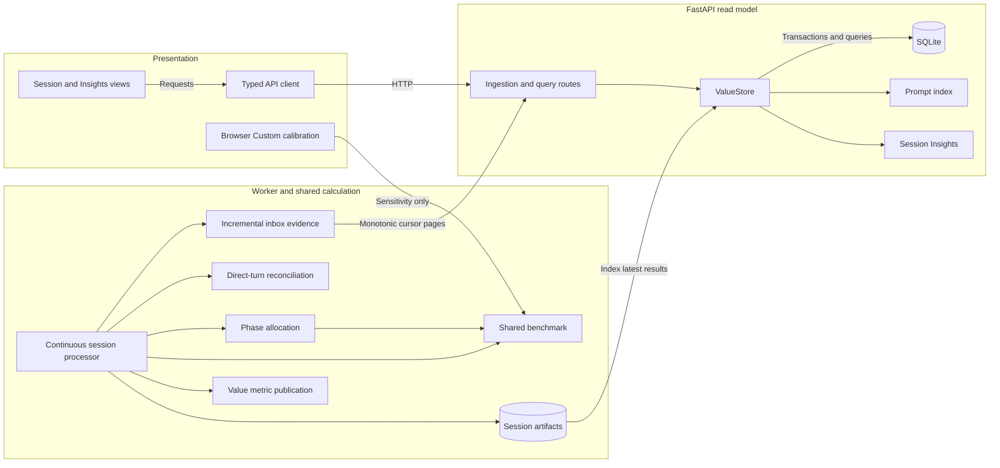

# Architecture Diagram

Algalon is a local analysis stack for GitHub Copilot activity across repositories. This reference describes the public application's existing architecture; it does not propose a migration or send local evidence to the public website.

## Application Architecture

<!-- mermaid-checked: no \n, no em-dash/en-dash, no {} in labels, subgraphs are id["label"], arrows are --&gt;|"label"|, all subgraphs closed by end, ids unique -->

### Technology Stack Summary

| Layer | Technology | Version | Purpose |
|---|---|---|---|
| Collection | OpenTelemetry Collector Contrib | 0.157.0 | Loopback OTLP ingestion and privacy processing |
| Processing | TypeScript on Node.js | Node.js 22+ | Session grouping, evidence reconciliation, phase allocation, and scenario calculation |
| Local API | FastAPI on Python | FastAPI 0.141.1; Python 3.11+ | Durable ingestion, indexing, session queries, Insights, and CSV export |
| Evidence storage | SQLite | Python runtime version | Transactional span inbox and queryable session/prompt read model |
| Dashboard | React | 19.x | Local API views and browser-only Custom sensitivity calculations |
| Aggregate storage | VictoriaMetrics | 1.148.0 | Observed telemetry and modeled value time series |
| Optional metrics UI | Grafana | 13.1.2 | Advanced views over aggregate metrics |
| Public website | Static HTML, CSS, and JavaScript | No application runtime | Product explanation and bundled synthetic examples |

### Data Storage & External Services

Named Docker volumes retain the SQLite inbox, prompt index, session results, metrics, and optional Grafana state. The worker reads spans through FastAPI cursor pages, not directly from SQLite. FastAPI is the single SQLite writer. Replayed spans are deduplicated, and late-arriving spans can update their original session.

Algalon's runtime does not need a GitHub token, billing access, or GitHub REST API calls. GitHub Copilot itself still uses its normal online services. Package installation needs access to package registries and container images. The public GitHub Pages website has no live connection to the local API or telemetry.

### Key Architectural Decisions

- Bind host services to `127.0.0.1`: app `3000`, optional Grafana `3001`, OTLP `4317/4318`, Collector health `13133`, and VictoriaMetrics `8428`.
- Keep ROI arithmetic in the shared TypeScript benchmark. FastAPI indexes results; React reads FastAPI only, never VictoriaMetrics or trace archives.
- Treat retained-source evidence conservatively. The worker does not mount repository source; unavailable same-session source means zero coding benefit. Prompt text remains local, honors retention settings, and never becomes a metric label.

## Component Relationships

<!-- mermaid-checked: no \n, no em-dash/en-dash, no {} in labels, subgraphs are id["label"], arrows are --&gt;|"label"|, all subgraphs closed by end, ids unique -->

### Component Inventory

| Component | Layer | Type | Responsibility |
|---|---|---|---|
| Session and Insights views | Presentation | React workflows | Display API evidence and modeled outcomes |
| Typed API client | Presentation | HTTP client | Read FastAPI endpoints |
| Browser Custom calibration | Presentation | Sensitivity view | Recalculate displayed estimates without changing observed evidence or worker-published values |
| Ingestion and query routes | Local API | FastAPI endpoints | Accept scrubbed trace batches and expose the local read model |
| ValueStore | Local API | SQLite transaction owner | Deduplicate ingestion, index artifacts, enforce retention, and query results |
| Prompt index | Local API | Evidence parser | Group prompt evidence and use matching read-only turn logs where available |
| Session Insights | Local API | Observed-evidence analysis | Derive operational measurements without reimplementing ROI arithmetic |
| Continuous session processor | Processing | Worker orchestration | Rebuild each authoritative session from accumulated evidence |
| Incremental inbox evidence | Processing | Cursor consumer | Fetch new spans without event-time ingestion filtering |
| Direct-turn reconciliation | Processing | Usage reconciliation | Refine complete matching usage with OTel fallback |
| Phase allocation | Processing | Evidence derivation | Split overlap once and allocate gap-bounded engaged time |
| Shared benchmark | Calculation | Pure TypeScript module | Calculate scenario-sensitive manual time, net value, and break-even estimates |
| Value metric publication | Processing | Metric publisher | Publish aggregate metrics without sensitive labels |
| Session artifacts | Storage | Local result files | Preserve each session's latest worker result for indexing |