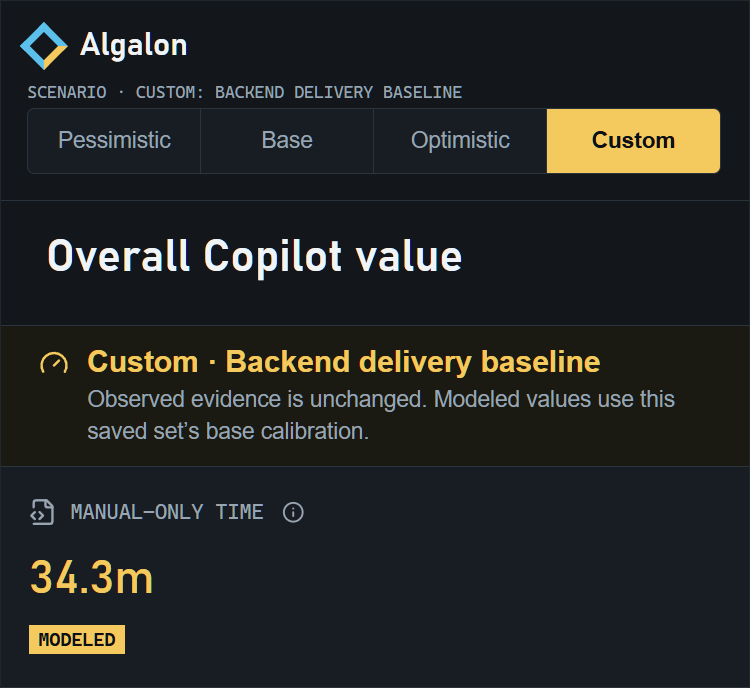
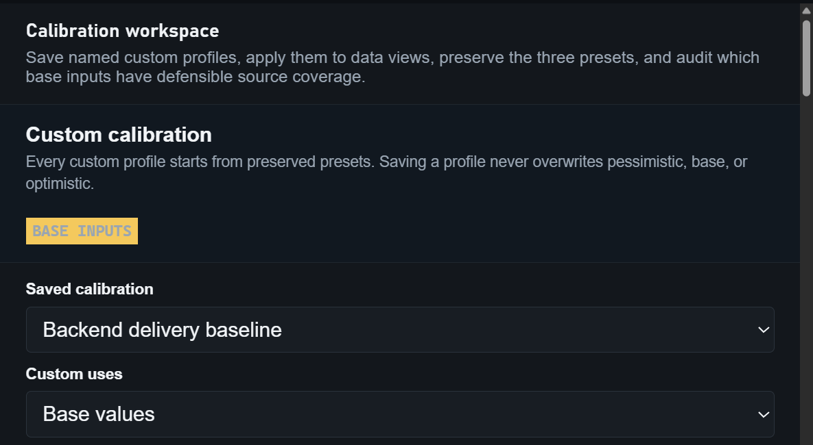
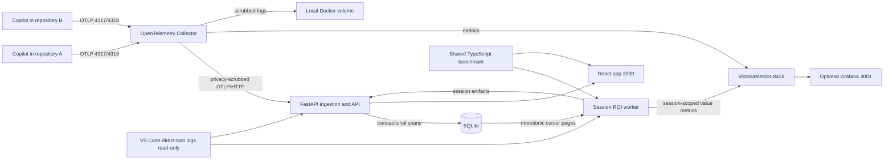

# Algalon

This project packages a central local GitHub Copilot ROI calculator and drill-down web app. One loopback-only stack aggregates OTel sessions from every local repository using the configured VS Code instance. It requires no GitHub token and makes no GitHub REST calls.

- **Project website** at <https://melabadi.github.io/Algalon/> introduces the app, features, methodology, evidence, and installation. Sources live in [site/](site/).
- **Algalon** at <http://127.0.0.1:3000> provides overall, session, prompt, prompt-detail, and methodology views, plus an explicit local CSV export of every indexed session and prompt.
- **Session Insights** at <http://127.0.0.1:3000/insights> derives twelve operational measurements from complete authoritative settled-session usage. Prompt retention never affects these values; incomplete session usage fails closed. Signals are explicit Algalon triage defaults rather than universal norms. See [Session insight metrics](docs/session-insights.md).
- **Grafana** remains an optional advanced metrics surface at <http://127.0.0.1:3001> when its Compose profile is enabled.

This README is the contributor and development guide. For installing a release into a user's repository, see [Local deployment](docs/local-deployment/README.md). The rationale, formula iterations, shortcomings, and benchmark examples are documented in [ROI Formula Evolution](docs/roi-formula-evolution.md).

All raw telemetry stays on the developer workstation. Licensed under [Apache-2.0](LICENSE).

## Application views

These screenshots use synthetic session evidence and a synthetic calibration set. They contain no prompt text, repository identity, or workstation telemetry.

### Portfolio sensitivity



The overall view keeps observed evidence fixed while comparing modeled time, value, and return. Concurrent session intervals are unioned before developer time is priced, while every session's observed AI usage remains included. **Pessimistic**, **Base**, and **Optimistic** use the current worker-published branches. **Custom** applies the browser-local calibration set selected in Methodology without changing those worker results.

The model-cohort table groups the currently displayed sessions by their exact request-bearing model set. It sums requests and observed AI cost, then reports medians over valid whole-session modeled outcomes. Mixed-model sessions remain one explicit mixed cohort; the table is descriptive and never attributes a session's benefit to an individual model.

### Calibration methodology



The Methodology view exposes every modeled input, preserves a snapshot of the three worker branches, records which saved-set branch the **Custom** button uses, and shows whether each base input has direct evidence, contextual evidence, or still needs local calibration.

## Architecture



The Collector owns the standard OTLP ports and privacy processing. It sends scrubbed traces directly to FastAPI over the internal Docker network, where each span is committed transactionally to SQLite and deduplicated by span identity. The TypeScript worker reads monotonic SQLite cursor pages, calculates overlap-safe phase scenarios, and publishes `copilot_value_*` metrics. It reconciles model/token/credit usage from the matching read-only VS Code direct-turn log when available, with OTel fallback. Standard Copilot OTel does not expose a trustworthy repository root or retained-source delta, so central sessions mark source evidence unavailable and assign zero coding benefit. FastAPI also indexes worker artifacts and ordered prompt evidence into the same local read model; React queries that API.

The pure ROI calculation lives in `shared/benchmark.ts`. The worker uses it for persisted artifacts and metrics. React uses the same module only for the browser-local **Custom** sensitivity view over FastAPI-provided session evidence; FastAPI does not calculate ROI. Custom evaluation never changes observed evidence or worker-published metrics.

Transactional OTLP ingestion lives in `backend/app/store.py`; `src/incremental-evidence.ts` checkpoints the monotonic SQLite inbox cursor and accumulated session evidence in worker state. Span replay is idempotent, late spans update the same session, and no file rotation protocol participates in normal collection. During an upgrade from archive-based collection, FastAPI streams retained scrubbed archives into the inbox once, deduplicates them against live spans, and records a durable completion marker. Session aggregation, direct-turn reconciliation, and source statistics have separate worker modules. React's `App.tsx` is the navigation shell; session, insight, calibration, and methodology workflows live under `web/src/features/`. Common UI text and locale-sensitive formatting use the typed catalog under `web/src/i18n/`, while backend-owned insight text includes stable message keys for future translations.

## Prerequisites

- Windows, macOS, or Linux
- Docker with Compose support
- Python 3.11 or later

The pinned runtime images provide both `linux/amd64` and `linux/arm64` manifests, including Apple Silicon support.

Node.js 22 or later is required only when developing or building this project, not when using the release bundle.

No GitHub Enterprise role, API permission, billing access, or token is required.

## Development

### Install dependencies

```powershell
npm ci
npm ci --prefix web
python -m pip install -r backend/requirements.txt
```

Use Node.js 22 or later and Python 3.11 or later. Runtime configuration is local and ignored. Create it from the checked-in examples before starting the stack directly:

```powershell
Copy-Item config/value-model.example.json config/value-model.local.json
Copy-Item docker/.env.example docker/.env
```

Review the modeled assumptions in `config/value-model.local.json` and set `benchmark.acknowledgedAssumptions` only after accepting or calibrating them.

### Run the full stack

```powershell
docker compose --env-file docker/.env -f docker/compose.yaml up --build
```

Keep this foreground process open during development. On Windows installations where `docker` is a one-shot `wsl.exe` wrapper, the foreground process also keeps the WSL VM alive. The packaged CLI handles that keepalive automatically for detached end-user installations.

Add `--profile grafana` to start optional Grafana. Stop with `Ctrl+C`, then remove the containers while retaining named volumes:

```powershell
docker compose --env-file docker/.env -f docker/compose.yaml down
```

### Run frontend and backend with reload

For an empty or fixture-backed local read model, start Uvicorn on `8000` and Vite on `5173` in separate terminals. Set the backend paths to local files before starting Uvicorn:

```powershell
$env:COPILOT_VALUE_DB = "$PWD/data/development/value.db"
$env:COPILOT_VALUE_SESSION_DIR = "$PWD/data/value/sessions"
$env:COPILOT_VALUE_TRACE_ARCHIVE = "$PWD/data/otel/traces.json"
$env:COPILOT_VALUE_CONFIG = "$PWD/config/value-model.local.json"
python -m uvicorn backend.app.main:app --reload --port 8000
```

```powershell
npm run dev:live --prefix web
```

`npm run dev --prefix web` remains an alias for live mode. It proxies `/api` to FastAPI on `http://127.0.0.1:8000` by default.

To develop the frontend against an already-running packaged stack at `3000`, set `VITE_API_PROXY_TARGET` before starting Vite:

```powershell
$env:VITE_API_PROXY_TARGET = "http://127.0.0.1:3000"
npm run dev:live --prefix web
```

For frontend-only development, start mock mode without Python, Docker, or retained local telemetry:

```powershell
npm run dev:mock --prefix web
```

Mock mode serves synthetic sessions, prompts, insights, methodology, health, and CSV responses from Vite at `http://127.0.0.1:5173`. The fixtures are development-only and never enter the production browser bundle.

To compare live and mock behavior side by side, leave live mode on `5173` and start mock mode on another port:

```powershell
npm run dev:mock --prefix web -- --port 5174
```

### Preview the project website

Build the same static artifact deployed to GitHub Pages, then serve it locally:

```powershell
python scripts/build_pages_site.py
python -m http.server 8080 --bind 127.0.0.1 --directory _site
```

Open <http://127.0.0.1:8080>. The site has no runtime API dependency; it loads the checked-in scenario assumptions and curated evidence register from the staged model JSON.

### Validate changes

```powershell
python -m pip install -r requirements-dev.txt
npm run test:coverage
npm run build --prefix web
```

`npm run test:coverage` enforces at least 90% line coverage independently for the TypeScript calculation/evidence worker, Python installer, FastAPI/SQLite backend, and React/API frontend. Type-only files, the React bootstrap, and TypeScript executable adapters are outside line instrumentation; the portable bundle smoke validates the packaged CLI adapters end to end.

Use `python scripts/copilot_value.py bundle` for a release build and `python scripts/copilot_value.py smoke-bundle --skip-build` to validate the exact generated artifact. The full smoke requires Docker and temporarily occupies the product ports.

Generated `node_modules/`, `dist/`, `web/dist/`, `data/`, local configuration, Compose `.env`, and release `artifacts/` are ignored and may be regenerated. Keep the current release artifacts only when they are needed for distribution or smoke testing.

### Public-source safety

Public releases are gated on CodeQL, dependency audits, secret scans, coverage, and exact-artifact smoke tests. ZIP and PYZ downloads include SHA-256 checksums and build-provenance attestations; newly published releases are immutable. See [Security](SECURITY.md) for verification and private vulnerability reporting.

Run `python -m unittest discover -s test -p test_public_source.py` before staging a public change. It rejects private/generated files, corporate package endpoints, personal contacts and workstation paths, and nonpublic lockfile URLs. Run Gitleaks against the final source tree and commit history as a separate credential check; these checks do not replace review of screenshots, fixtures, or new external links.

When importing from a private development repository, copy only reviewed source into a clean public checkout. Do not push private history or tags. Use a public handle and GitHub no-reply commit email, preserve the license, and keep real telemetry, CSV exports, settings backups, local configuration, and release build output out of source commits.

### Agent-assisted development

Project-wide invariants live in `.github/copilot-instructions.md`. Scoped instructions under `.github/instructions/` cover the frontend, backend, TypeScript worker, runtime packaging, and documentation without loading unrelated guidance.

Reusable workflows under `.github/skills/` cover local deployment, release validation, and ROI-model changes. These skills are available to compatible coding agents by description or slash command. The project intentionally uses `copilot-instructions.md` as its one always-on instruction source instead of duplicating it in `AGENTS.md`.

## Quick start from a local repository

With Python and Docker already installed, the primary distribution is one self-installing file: `copilot-value-dashboard-<version>.pyz`. No manual extraction or folder creation is required.

### 1. Obtain the application

Download `copilot-value-dashboard-<version>.pyz`, or generate it from this source checkout:

Windows:

```powershell
npm ci
python .\scripts\copilot_value.py bundle
```

macOS or Linux:

```sh
npm ci
python3 scripts/copilot_value.py bundle
```

Build output is written to `artifacts/`. Node.js is needed only to build the application; a person using the generated `.pyz` does not need Node.js on the host.

### 2. Install once from a convenient repository root

Windows:

```powershell
Set-Location C:\Repos\my-project
python C:\Downloads\copilot-value-dashboard-0.2.0.pyz
```

macOS or Linux:

```sh
cd ~/repos/my-project
python3 ~/Downloads/copilot-value-dashboard-0.2.0.pyz
```

That command:

- creates or upgrades `<repository>/.copilot-value` from the embedded runtime;
- adds `.copilot-value/` to the repository's `.gitignore`;
- configures both Copilot OTel setting families in every detected VS Code user settings file;
- creates the local value-model configuration and application database when absent;
- validates Docker and Docker Compose;
- pulls the pinned Collector, VictoriaMetrics, Node, and Python images;
- builds and starts the continuous session worker and FastAPI/React app;
- mounts VS Code `User/workspaceStorage` read-only for exact local turn evidence when available;
- prints the application URL.

The command is idempotent. It preserves local configuration, credentials, and Docker volumes when run again. The containing repository is the installation home only; the Collector receives sessions from every local repository, so do not install another stack per repository.

Docker builds use public npm and PyPI defaults. `install --npm-registry <https-url> --pip-index-url <https-url>` supports explicit credential-free mirrors without importing host package-manager settings. See [Package downloads](docs/local-deployment/README.md#package-downloads).

VS Code declares these OTel settings as application-scoped and ignores them in `<repository>/.vscode/settings.json`. The installer therefore updates the effective user settings file, preserves unrelated settings, and backs up its previous JSONC content under `.copilot-value/data/vscode-settings-backups/`.

For the exact user-level JSONC keys, manual verification, and recovery steps, see [Verify or configure VS Code manually](docs/local-deployment/README.md#verify-or-configure-vs-code-manually).

### 3. Reload VS Code

Run **Developer: Reload Window** after installation. Existing Copilot sessions do not hot-load OTel configuration, so start a new session after the reload.

The Collector removes response/reasoning content, system instructions, tool definitions and payloads, commands, file paths, repository metadata, hook payloads, and MCP server names. The app also mounts the detected VS Code `User/workspaceStorage` directory read-only and opens only the `main.jsonl` file whose folder name exactly matches the OTel `gen_ai.conversation.id`/`copilot_chat.chat_session_id` for the segmented resource session. Direct `user_message` events define prompt boundaries; following `llm_request.copilotUsageNanoAiu` values are summed until the next direct user message, matching the credit counter shown by Copilot. Prompt text is persisted only in the bounded SQLite prompt index. It is never exported as a metric label or sent off the workstation. Set `promptStorage.enabled` to `false` to keep prompt statistics but omit stored prompt text.

### 4. Verify the installation

Windows:

```powershell
python .\.copilot-value\scripts\copilot_value.py status
```

macOS or Linux:

```sh
python3 .copilot-value/scripts/copilot_value.py status
```

The command reports `yes` for `victoria-metrics`, `collector`, `worker`, and `app`, plus their HTTP health checks. Then open <http://127.0.0.1:3000>. The app is loopback-only and does not require a local login.

### 5. Use Copilot in any local repository

The stack must be running while Copilot emits OTel. Open a GitHub Copilot chat/agent session in any local repository and work normally. No experiment start, stop, naming, repository registration, or completion command is required.

The worker detects each OTel `session.id` in the transactional inbox and continuously updates one privacy-safe dashboard segment for that ID. It does not ignore a session because it began before a worker restart. Repository identity and paths are removed at the Collector privacy boundary, and retained source is reported as unavailable rather than inferred from the installation repository.

### Normal operations

Use the same repository-local CLI after installation:

| Action | Windows | macOS or Linux |
| --- | --- | --- |
| Start | `python .\.copilot-value\scripts\copilot_value.py start` | `python3 .copilot-value/scripts/copilot_value.py start` |
| Status | `python .\.copilot-value\scripts\copilot_value.py status` | `python3 .copilot-value/scripts/copilot_value.py status` |
| Stop | `python .\.copilot-value\scripts\copilot_value.py stop` | `python3 .copilot-value/scripts/copilot_value.py stop` |

`stop` preserves SQLite, metrics, telemetry, prompt evidence, and session state in repository-scoped Docker volumes.

### Optional Grafana

The React app is the primary interface. To start the legacy/advanced Grafana metric explorer on port `3001`:

```powershell
python .\.copilot-value\scripts\copilot_value.py grafana
```

The command prints the local Grafana password. Grafana reads the same VictoriaMetrics series and does not replace the React drill-down app.

### Upgrade

Download the newer `.pyz`, enter the target repository, and run it again. The upgrader stages the complete runtime first, stops the existing stack to release bind-mounted files, replaces files transactionally, recreates the containers, and starts the stack again. Local configuration, credentials, and persistent volumes are preserved. If file replacement fails, the previous runtime is restored.

### Manual zip fallback

The build also produces a conventional `.zip`. When a `.pyz` cannot be used, extract the zip's contents directly into `<repository>/.copilot-value`, then run:

Windows:

```powershell
python .\.copilot-value\scripts\copilot_value.py install
```

macOS or Linux:

```sh
python3 .copilot-value/scripts/copilot_value.py install
```

Do not create a nested version directory under `.copilot-value`. The expected path is `.copilot-value/scripts/copilot_value.py`.

Only one stack can be active on a machine because it binds local ports `3000`, `4317`, `4318`, `13133`, and `8428`. Optional Grafana additionally binds `3001`. That one stack is the central collector for all local repositories.

The transactional SQLite telemetry inbox, scrubbed logs, metrics, and optional Grafana state remain on the developer workstation. No repository filesystem is mounted into the central worker.

## Configure value assumptions

The installer creates the ignored local configuration from the example when it is missing. For a repository-root installation, edit:

```powershell
code .\.copilot-value\config\value-model.local.json
```

Set:

- fully loaded hourly rate
- phase tool-name patterns
- pessimistic, base, and optimistic token relevance, review rate, interaction overhead, code-entry rate, and unclassified multipliers
- capacity realization and characters-per-word assumptions
- curated calibration sources, their exact applicability, findings, and limitations
- whether prompt text is stored locally and its retention period

The repository installer enables the bundled modeled assumptions on first install. Review them before presenting ROI outside a local evaluation.

The worker persists and publishes only the three configured scenario branches. The React app adds a fourth **Custom** selector for local sensitivity analysis. A named set is saved in browser storage from Methodology, and its **Custom uses** field chooses which calibrated branch the Custom button evaluates. The preset buttons always continue to show worker-published values. Export the set into `value-model.local.json` and restart only when the worker itself should publish those calibrated assumptions.

## Automatic session measurement

No manual start or completion command is required. The Collector and worker continuously process scrubbed OTel spans:

1. It discovers every authoritative OTel resource attribute `session.id` emitted by GitHub Copilot, regardless of repository.
2. It assigns one stable privacy-safe segment to each ID.
3. It reconciles exact direct-turn credits/model/tokens from every matching conversation log carried by that resource session. If the complete set is unavailable, it uses the complete OTel fallback instead of partial direct usage.
4. It calculates non-overlapping phase evidence and scenario values for that session only.
5. It records source evidence as unavailable and uses zero retained characters, so coding tools alone cannot create coding benefit.
6. It publishes a label such as `session-20260805-101112-a1b2c3d4e5`; the raw session ID is never published.
7. On every poll, cursor-ordered new spans or direct-turn usage update the same session label. No inactivity or completion rule creates boundaries.
8. FastAPI indexes the latest session artifact and prompt groups into SQLite for the React drill-down views.

The Collector commits each privacy-scrubbed span to SQLite before acknowledging export. The worker persists one integer inbox cursor and reads only later rows. A unique span key makes replay idempotent, while event timestamps remain evidence rather than ingestion filters, so late spans update the correct session.

When upgrading an installation that still has scrubbed `traces*.json` files, the app imports those files into the inbox exactly once before marking the archive migration complete. The import is resumable and idempotent; later collection remains Collector-to-SQLite only.

Every authoritative session in the local telemetry inbox is eligible for indexing. Because standard Copilot OTel does not carry retained-source evidence, the central worker never combines telemetry from one repository with a filesystem snapshot from another.

The Collector endpoint is configured in VS Code user settings, not repository settings. One running stack therefore accepts Copilot OTLP events from every local workspace and directory; the repository containing the installation is only the stack's operational home.

The default refresh interval is five seconds. To change it, rerun `install` with a different interval:

Windows:

```powershell
python .\.copilot-value\scripts\copilot_value.py install --poll-seconds 10
```

macOS or Linux:

```sh
python3 .copilot-value/scripts/copilot_value.py install --poll-seconds 10
```

## What is observed

The Collector accepts these local OTel instruments when available. Central per-session calculation uses the session-scoped trace and direct-turn evidence; aggregate native metrics remain available in VictoriaMetrics:

- `copilot_chat.edit.acceptance.count`: accepted, rejected, and unmapped edit decisions
- `copilot_chat.lines_of_code.count`: LoC added or removed by accepted agent edits
- `copilot_chat.edit.survival.four_gram` and `.no_revert`: retained-code quality factors
- `copilot_chat.user.action.count`: apply, insert, and copy engagement
- `copilot_chat.tool.call.count`: successful tool calls and their names
- session, invocation, turn, model, token, latency, and error metrics
- scrubbed chat-span attributes including request model, input/cache-read/output/reasoning tokens, and `copilot_chat.copilot_usage_nano_aiu`
- explicit source-evidence completeness; central sessions publish `0` with `evidence="otel_only"`
- local direct-turn prompt groups containing user-request text, timestamps, model/tool counts, tokens, AI credits, and their dollar-equivalent usage value

The current public OTel contract does not expose a canonical Ask/Edit/Plan/Agent mode dimension. Tool classifications are therefore conservative proxies:

- Coding proxy: Copilot-reported successful tool executions matching configured patch/create/semantic-rename patterns.
- Research proxy: successful tool names matching configured search/read/fetch-like patterns.
- Planning proxy: successful tool names matching configured todo/planning patterns.
- Unmatched successful tools: displayed as unmapped and excluded from benefit.

## How benchmark time and money are estimated

Each indexed Copilot session partitions measured **engaged** AI-assisted time into planning, research, coding, validation, and unclassified phases. Engaged time is the union of observed span activity with idle gaps up to `benchmark.maxIdleGapSeconds` (default 300) bridged as think time; longer idle is excluded. Elapsed window duration and activity density are still published as observed evidence. Only OTel spans carrying the same `session.id` are counted in a session. Tool spans are classified by configured tool-name patterns. Each cost-bearing primary chat span inherits the phase of the next tool it prepared. Overlapping phase intervals are split rather than counted twice; engaged time outside spans is allocated in proportion to active phase time. A session with no eligible active spans allocates zero and produces no ROI. Therefore:

$$
T_{AI} = \sum_p T_{AI,p} = \frac{W_{engaged}}{60}
$$

**Code correspondence:** [gap bounding, overlap-safe segmentation, and engaged-time allocation](src/phase-evidence.ts#L47-L180), with the benchmark summing phase seconds at [shared/benchmark.ts, lines 225-230](shared/benchmark.ts#L225-L230).

Manual phase time is estimated from phase-specific evidence rather than a speedup percentage. Let $U$ be uncached input tokens, $O$ output tokens, $Q$ reasoning tokens, $\omega$ the configured reasoning-token weight, $N$ tool executions, $D$ non-overlapping tool runtime, $C$ exact added/modified characters retained at completion, and $c$ characters per word:

$$
T_{manual,planning,s} = \frac{\alpha_{P,s}(O_P+\omega_{P,s}Q_P)}{v_{P,s}} + N_P\tau_{P,s}
$$

**Code correspondence:** [shared/benchmark.ts, lines 266-271](shared/benchmark.ts#L266-L271).

$$
T_{manual,research,s} = \frac{\alpha_{R,s}U_R}{v_{R,s}} + N_R\tau_{R,s}
$$

**Code correspondence:** [shared/benchmark.ts, lines 272-277](shared/benchmark.ts#L272-L277).

$$
T_{manual,coding,s} = \frac{f_sC}{cw_s}
$$

**Code correspondence:** [shared/benchmark.ts, lines 278-279](shared/benchmark.ts#L278-L279).

$$
T_{manual,validation,s} = D_V + \frac{\alpha_{V,s}(O_V+\omega_{V,s}Q_V)}{v_{V,s}} + N_V\tau_{V,s}
$$

**Code correspondence:** [shared/benchmark.ts, lines 280-286](shared/benchmark.ts#L280-L286).

$$
T_{manual,unclassified,s} = m_sT_{AI,unclassified}
$$

**Code correspondence:** [shared/benchmark.ts, line 287](shared/benchmark.ts#L287). The common token term used by planning, research, and validation is implemented at [lines 124-135](shared/benchmark.ts#L124-L135).

$\alpha$ is the fraction of phase tokens assumed relevant to equivalent human work, $\omega$ is the share of reasoning tokens treated as reviewable, $v$ is reading/review tokens per minute, $\tau$ is interaction overhead per tool, $f$ is the fraction of retained source requiring manual entry, $w$ is code-entry words per minute, and $m$ is the unclassified fallback multiplier. Reasoning tokens are never rendered to the developer, so $\omega$ is zero in the pessimistic and base branches. The configured sensitivity range is:

| Calibration | Pessimistic | Base | Optimistic |
|---|---:|---:|---:|
| Relevant token fraction $\alpha$ | 10% | 25% | 50% |
| Reasoning token weight $\omega$ | 0% | 0% | 25% |
| Review rate $v$ | 600 tok/min | 400 tok/min | 250 tok/min |
| Tool interaction $\tau$ | 0.12 min | 0.25 min | 0.50 min |
| Manual source-entry fraction $f$ | 25% | 50% | 100% |
| Code-entry rate $w$ | 60 WPM | 40 WPM | 25 WPM |
| Unclassified multiplier $m$ | 1.0× | 1.25× | 1.5× |

**Code correspondence:** the scenario constants are defined in [config/value-model.example.json, lines 152-176](config/value-model.example.json#L152-L176), schema defaults mirror them in [src/schema.ts, lines 85-121](src/schema.ts#L85-L121), and their parity is checked in [test/schema.test.ts, lines 7-38](test/schema.test.ts#L7-L38).

This table defines the three worker-published branches. The loaded rate $H$, capacity realization $\rho$, and idle threshold $G$ are deliberately identical across branches, so this range is a counterfactual sensitivity, not a confidence interval. Each scenario also reports benefit, net value, ROI, and break-even manual time at $\rho\in\{0.25,0.50,0.75\}$ so the capacity assumption's leverage is visible. **Custom** is not a fourth formula or metric label. It resolves to one branch from a named browser-local calibration set and runs the same benchmark formula over the session evidence returned by FastAPI.

For every phase:

$$
T_{saved,p,s} = T_{manual,p,s} - T_{AI,p}
$$

**Code correspondence:** [shared/benchmark.ts, lines 288-301](shared/benchmark.ts#L288-L301).

The formula supports matched retained-source evidence, but the central worker sets $C=0$ because standard Copilot OTel does not provide it. Consequently, observed coding time can reduce savings, while coding tool calls and tokens cannot manufacture coding benefit. If a future source-aware agent supplies a correctly matched retained delta, survival remains audit evidence rather than a second discount. Total modeled savings are:

$$
T_{saved,s} = \sum_p T_{saved,p,s}
$$

**Code correspondence:** [shared/benchmark.ts, lines 257-261](shared/benchmark.ts#L257-L261).

With loaded hourly rate $H$ and capacity realization $\rho$:

$$
B_s = \frac{T_{saved,s}}{60}H\rho
$$

**Code correspondence:** per-minute labor and realized value are computed at [shared/benchmark.ts, lines 257-262](shared/benchmark.ts#L257-L262), then applied to savings at [line 311](shared/benchmark.ts#L311).

AI usage value uses `copilotUsageNanoAiu` from the exact local VS Code direct-turn log when available, with the matching OTel trace spans as fallback. One AI credit is $0.01$:

$$
C_{AI} = \frac{\sum \text{copilot\_usage\_nano\_aiu}}{10^{11}}
$$

**Code correspondence:** OTel fallback conversion is at [src/experiment-evidence.ts, lines 195-215](src/experiment-evidence.ts#L195-L215); exact matching direct-turn conversion is at [src/direct-turns.ts, lines 130-155](src/direct-turns.ts#L130-L155).

The comparative views also expose manual-only and AI-assisted delivery costs at the same loaded labor rate, plus a bounded reduction ratio:

$$
\begin{aligned}
C_{manual,s} &= \frac{T_{manual,s}}{60}H \\
C_{assisted} &= \frac{T_{AI}}{60}H+C_{AI} \\
\Delta C_{gross,s} &= C_{manual,s}-C_{assisted} \\
R_s &= \frac{\Delta C_{gross,s}}{C_{manual,s}}
\end{aligned}
$$

**Code correspondence:** [shared/benchmark.ts, lines 307-336](shared/benchmark.ts#L307-L336).

$$
ROI_s = \frac{B_s-C_{AI}}{C_{AI}}
$$

**Code correspondence:** net value is computed at [shared/benchmark.ts, line 312](shared/benchmark.ts#L312), and ROI with its zero-cost guard at [lines 337-345](shared/benchmark.ts#L337-L345). The central zero-source input is supplied at [src/continuous.ts, lines 310-320](src/continuous.ts#L310-L320).

Realized net gain $B_s-C_{AI}$, break-even manual time, and the bounded reduction $R_s$ are the primary reported figures. $ROI_s$ divides by observed AI credit spend alone, so it rises when the same work is done with a cheaper model; it is retained as a clearly labeled secondary ratio rather than a headline. Gross delivery savings $\Delta C_{gross,s}$ are shown for direct comparison, but they are not the ROI numerator. The break-even panel reports the manual duration at which estimated realized labor value recovers $C_{AI}$ under the configured labor rate and capacity-realization factor, and repeats that threshold across the capacity band. Model/token categories, phase tokens, tool runtime, and measured phase allocation are published for audit. Tool counts contribute only the configured interaction overhead; they are not assigned fixed minutes saved. Every persisted benchmark carries a `formulaVersion`, and the read model refuses to aggregate results from another version. These calibration values must be replaced with locally measured rates for stronger claims.

## Validation and privacy

Run the TypeScript and Python test suites, then boot an extracted release for its full telemetry smoke:

```powershell
npm test
python -m unittest discover -s test -p test_copilot_value.py
python -m unittest discover -s backend/tests -p test_*.py
npm ci --prefix web
npm run build --prefix web
python .\scripts\copilot_value.py smoke-bundle
```

Development validation checks Collector configuration, TypeScript ROI behavior, SQLite aggregation, React compilation, OTel classification, overlap-safe arithmetic, fixture calculations, and health endpoints. The release smoke boots the complete Docker stack, replays one identical OTLP payload, then delivers a new span whose event time predates session discovery. The exact artifact must deduplicate replay, expand the authoritative session start, reconcile elapsed usage with the public duration, preserve cumulative worker and SQLite evidence, and keep portfolio modeling available through React delivery.

Release runtime state is stored in installation-scoped Docker volumes. No repository source tree is mounted. Privacy-scrubbed spans are stored transactionally in SQLite and scrubbed logs remain local; span replay is deduplicated and late arrivals update existing sessions. VictoriaMetrics retains aggregate metrics for 90 days.

## Build and smoke-test a release

From a development checkout:

Windows:

```powershell
npm ci
python .\scripts\copilot_value.py bundle
python .\scripts\copilot_value.py smoke-bundle
```

macOS or Linux:

```sh
npm ci
python3 scripts/copilot_value.py bundle
python3 scripts/copilot_value.py smoke-bundle
```

The `bundle` command runs the test suite and creates:

- `artifacts/copilot-value-dashboard-<version>.pyz`
- `artifacts/copilot-value-dashboard-<version>.pyz.sha256`
- `artifacts/copilot-value-dashboard-<version>.zip`
- `artifacts/copilot-value-dashboard-<version>.zip.sha256`

The `.pyz` is the primary self-installing distribution. The `.zip` contains the same runtime for manual extraction. Both contain the Python CLI, compiled ROI worker, FastAPI backend, React source/build inputs, production dependencies, Docker Compose configuration, Collector configuration, optional Grafana configuration, and documentation. The React inputs include `web/mock` so an extracted source payload retains the documented Vite mock mode; those synthetic fixtures are not copied into the production browser build. The bundles intentionally exclude tests, development dependencies, example applications, and telemetry data.

The bundle smoke test extracts the zip into a temporary repository's `.copilot-value` directory, starts the packaged Docker stack, then verifies:

- repository-root installation and automatic `.gitignore` setup;
- absence of any repository bind mount in central session processing;
- authoritative `session.id` discovery and session-isolated AI usage;
- immediate `session.id` segmentation, repeated updates, and hashed session labels;
- conservative `otel_only` source state with zero retained characters for the central session;
- compiled fixture calculation without TypeScript or dev dependencies;
- OTLP metric ingestion on `4318`;
- privacy removal of a synthetic file path;
- automatic per-session ROI publication and VictoriaMetrics queryability;
- FastAPI/SQLite indexing of the synthetic session and prompt content;
- compiled React delivery and application health on port `3000`;
- clean shutdown and restoration of the development stack.

CI runs tests on Windows, macOS, and Linux. It validates the extracted bundle on Windows and boots the packaged Docker stack on Linux for synthetic OTel session measurement before uploading the platform-neutral zip and checksum.

Every successful push to `main` also creates a GitHub Release. CI reads the highest stable `vMAJOR.MINOR.PATCH` tag, increments its patch component (using `package.json` as the floor), stamps that version into the build, and publishes the exact `.pyz`, `.zip`, and both SHA-256 files that passed the Windows and Linux smoke tests. The version is applied only to the release build and tag; CI does not create a recursive version-bump commit.

## Limits

This is an individual directional benchmark, not a causal productivity study. The manual-time model uses explicit calibrated token, interaction, typing, and capacity assumptions rather than a measured no-AI counterfactual. A saved Custom set is a sensitivity input, not proof that its assumptions are true. AI-credit usage is observed economic usage value; it may be included allowance rather than incremental invoice spend. Tool names are activity proxies only. Standard Copilot OTel does not currently provide trustworthy repository attribution or retained-source delta, so the central dashboard cannot group by repository and gives coding no positive value without matched source evidence. A repeated comparable AI/no-AI task design provides stronger causal evidence.